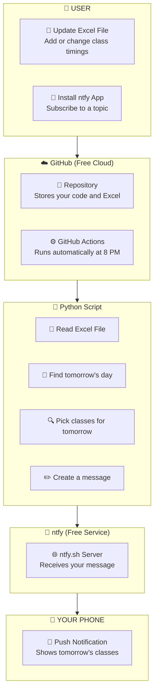

# TimeTable-Notifier

## Diagram

```mermaid
flowchart TD
    subgraph A["👤 USER"]
        S1["📝 Update Excel File<br/>Add or change class timings"]
        S2["📱 Install ntfy App<br/>Subscribe to a topic"]
    end

    subgraph B["☁️ GitHub (Free Cloud)"]
        B1["📁 Repository<br/>Stores your code and Excel"]
        B2["⚙️ GitHub Actions<br/>Runs automatically at 8 PM"]
    end

    subgraph C["🐍 Python Script"]
        C1["📖 Read Excel File"]
        C2["📅 Find tomorrow's day"]
        C3["🔍 Pick classes for tomorrow"]
        C4["✏️ Create a message"]
    end

    subgraph D["📡 ntfy (Free Service)"]
        D1["🌐 ntfy.sh Server<br/>Receives your message"]
    end

    subgraph E["📱 YOUR PHONE"]
        E1["🔔 Push Notification<br/>Shows tomorrow's classes"]
    end

    A --> B
    B --> C
    C --> D
    D --> E

```
